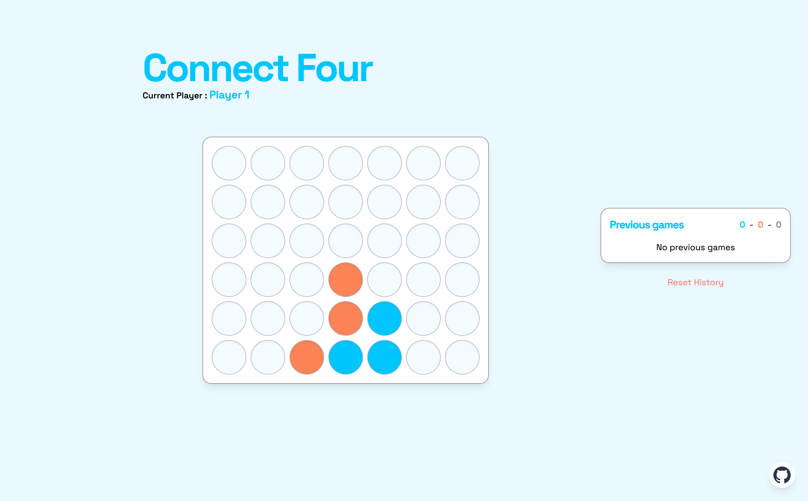

# Puissance 4 en Vanilla JS

## Fonctionnalités

- Joueur contre joueur en local
- Interface graphique simple et épurée avec Tailwind CSS
- Grille de jeu 7x6
- Détection automatique des victoires et des égalités
- Réinitialisation de la partie
- Affichage du joueur courant (tinte d'écran, titre du site, icône du site, texte...)
- Animations CSS pour les jetons
- Responsive design pour une utilisation sur mobile et tablette
- Historique des parties jouées

## Organisation du code

- `index.html` : Structure HTML de la page
- `src/main.ts` : Point d'entrée TypeScript avec l'interface du jeu
- `src/styles.css` : Styles CSS avec Tailwind CSS

- `src/types.ts` : Types TypeScript utilisés dans le projet

- `src/power-four.ts` : Initialisation & réinitilisation du jeu

- `src/consts.ts` : Constantes de jeu utiles pour la personnalisation du jeu
- `src/styles.ts` : Constantes de style utiles pour la personnalisation du jeu

- `src/game-logic.ts` : Logique du jeu (vérification des victoires, égalités, etc.)
- `src/game-utils.ts` : Fonctions utilitaires pour le jeu (gestion de la grille, des joueurs, etc.)
- `src/game-interface.ts` : Gestion de l'interface utilisateur (affichage, animations, etc.)
- `src/game-history.ts` : Gestion du stockage local pour l'historique des parties
- `src/interface-utils.ts` : Fonctions utilitaires pour l'interface utilisateur

## Points d'attention

- Le code est écrit en TypeScript pour une meilleure maintenabilité et robustesse
- Utilisation de Tailwind CSS pour un design rapide et réactif
- Utilisation de variables CSS pour simplifier le code

## Acquis

- Création de variables CSS dynamiques à l'aide de TypeScript
- Utilisation de JS vanilla pour manipuler le DOM et gérer les événements
- Puissance des librairies comme Vue.js ou React pour ce type de projet

## Ce que j'ai aimé

- L'environnement de développement que je me suis créé avec Vite, Tailwind CSS, TypeScript et ESLint est très agréable à
  utiliser.
- Le fait de ne pas utiliser de framework JS m'a permis de mieux comprendre le fonctionnement du DOM et des événements.
- La gestion de l'état du jeu et de l'interface utilisateur en JS vanilla est plus complexe qu'avec un framework, mais
  c'est un bon exercice.
- L'utilisation de Tailwind CSS m'a permis de créer une interface propre et responsive rapidement.

## Ce que j'ai moins aimé

- J'ai moins aimé la quantité de boilerplate nécessaire pour gérer l'état du jeu et de l'interface utilisateur en JS
  vanilla.

## Difficultés rencontrées

- Animer les jetons avec des transitions CSS a été plus compliqué que prévu, surtout pour gérer les différentes
  vitesses et les effets de rebond.
- La quantité de code nécessaire pour gérer l'état du jeu et de l'interface utilisateur en JS vanilla est
  importante, ce qui a rendu le code plus difficile à maintenir.
- La gestion des événements et des interactions utilisateur en JS vanilla est plus complexe qu'avec un framework, ce qui
  a nécessité plus de temps pour déboguer et tester.

## Améliorations possibles

- Ajouter une option pour jouer contre une IA avec différents niveaux de difficulté.
- Ajouter des animations supplémentaires pour rendre le jeu plus dynamique.
- Ajouter des sons pour les actions du jeu (placement de jeton, victoire, égalité, etc.).
- Ajouter un mode multijoueur en ligne pour jouer contre des amis. ← Peut être très marrant à faire avec les
  WebSockets mais nécessite un backend.

## Conclusion

Ce projet m'a permis de renforcer mes compétences en JavaScript, TypeScript et Tailwind CSS, tout en me confrontant aux
défis de la gestion de l'état et de l'interface utilisateur sans framework. Je suis satisfait du résultat final et des
fonctionnalités implémentées, et je vois de nombreuses possibilités d'amélioration pour rendre le jeu encore plus
attrayant et interactif.

Cela dit, je pense que l'architecture du code pourrait être améliorée, notamment en séparant mieux la logique du jeu et
l'interface utilisateur.